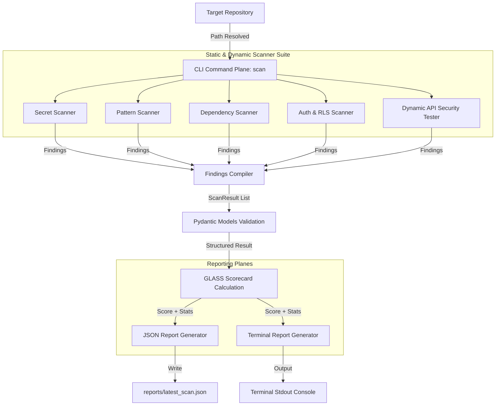

# ZeroClaw Scanner

Automated security scanner and vulnerability auditing tool designed to secure codebases within the LifeAtlas ecosystem.

---

## 📖 Overview

**ZeroClaw Scanner** is a modular, multi-phase static and dynamic security auditing tool. It identifies security issues across multiple domains, including hardcoded secrets, third-party package vulnerabilities (CVEs), dangerous code patterns (such as SQL injection and XSS), FastAPI endpoint authentication gaps, and missing database access control policies.

Additionally, ZeroClaw integrates an **AI-driven Agent Enrichment Phase** that automatically analyzes critical vulnerability findings using local LLM intelligence, adding reasoning chains and ready-to-apply corrected code blocks.

---

## 🚀 Key Features

*   **🔑 Secret Scanner**: Recursively scans codebases for API keys, database credentials, tokens, and certificates.
    *   *Features*: Strips code comments before evaluation to prevent developers masking credentials; ignores dummy placeholder structures; limits file sizes to `5MB` to prevent Out-of-Memory (OOM) situations.
*   **📦 Dependency Scanner**: Audits project manifest files (`package.json`, `requirements.txt`, `pyproject.toml`).
    *   *Features*: Evaluates packages against the **Google OSV API** database; includes an offline fallback database for local, isolated development; checks for supply chain risks like unpinned dependencies and missing package verification hashes.
*   **🛡️ Pattern Scanner**: Scans source code files (`.py`, `.js`, `.ts`, etc.) for injection vectors and unsafe design practices.
    *   *Features*: Detects raw SQL string execution (SQLi), direct DOM innerHTML modifications (XSS), and arbitrary subprocess commands executed with `shell=True`. Includes a sliding window buffer to find multi-line vulnerabilities.
*   **🔒 Auth & RLS Scanner**: Dual-purpose parser checking for access control gaps in API routing and DB structure.
    *   *FastAPI Auth*: Uses Python's Abstract Syntax Tree (AST) to verify that HTTP routing endpoints enforce an authentication dependency (e.g. `Depends(get_current_user)`).
    *   *Supabase RLS*: Parses SQL schema migration files (`.sql`) to verify that all created tables have active row-level security declarations (`ALTER TABLE ... ENABLE ROW LEVEL SECURITY;`).
*   **⚡ Dynamic API Security Tester**: Launches ephemeral mock environments to run active verification against:
    *   *Auth Bypass*: Hammers routes with invalid/expired tokens, asserting rejection (`401` / `403`).
    *   *Rate Limiting*: Fires traffic at high velocities, verifying that the server triggers `429 Too Many Requests`.
    *   *Session Security*: Tests for session fixation rotation, hijacking validation, and inactivity timeout.

---

## 📐 System Architecture

ZeroClaw scans run through a strict **3-Phase pipeline**:

1.  **Gathering Phase**: Parallel static scanners crawl the target codebase for findings.
2.  **Enrichment Phase**: High/critical findings are piped to the ZeroClaw LLM agent client to construct a remediation reasoning chain and generate safe code fixes.
3.  **Reporting Phase**: Compiles findings into GLASS security scoring, stats, and exports formats.



---

## 📂 Codebase Directory Structure

```text
zeroclaw-scanner/
├── src/
│   └── zeroclaw/
│       ├── cli.py                   # CLI parser and subcommand routing
│       ├── models.py                # Structured Pydantic data schemas
│       ├── reporter.py              # Scorecard calculation and report formatting
│       ├── agent_client.py          # AI agent integration wrapper for enrichment
│       └── scanners/                # Security scanner plugins
│           ├── secret_scanner.py         # Credential / entropy scanner
│           ├── dependency_scanner.py     # Pip/npm manifest vulnerability scanner
│           ├── pattern_scanner.py        # Code pattern auditor (SQLi, XSS, Cmd Injection)
│           ├── auth_scanner.py           # AST FastAPI protector & Supabase SQL auditor
│           └── api_security_tester.py    # Ephemeral mock API penetration testing harness
├── tests/                           # Unit and Integration test suites
│   ├── conftest.py                  # Vulnerable & clean file system mocks
│   ├── test_cli.py                  # CLI integration tests
│   ├── test_reporter.py             # GLASS scorecard and formatting tests
│   ├── test_secret_scanner.py
│   ├── test_dependency_scanner.py
│   ├── test_pattern_scanner.py
│   ├── test_auth_scanner.py
│   └── test_api_security_tester.py
├── reports/                         # Scan output reports (JSON format)
├── Makefile                         # Developer shortcuts (test, lint, scan, report)
├── pyproject.toml                   # Project metadata, dependencies, and script routing
└── requirements.txt                 # Frozen pip dependencies
```

---

## 🛠️ Installation & Setup

### Prerequisites
*   **Python**: `>= 3.12`
*   **Node.js / npm**: Required for running the dependency scanner on Node projects.

### 1. Setup Environment & Dependencies
Clone the repository and install it in editable mode with development dependencies:

```bash
# Clone the repository
git clone https://github.com/Life-Atlas/zeroclaw-scanner.git
cd zeroclaw-scanner

# Install package and dev packages
pip install -e ".[dev]"

# (Optional) Register Git pre-commit hooks
pre-commit install
```

### 2. Verify Installation
Ensure that the CLI registers properly in your shell context:
```bash
zeroclaw-scanner --help
```

---

## 💻 CLI Usage

All scans and report operations can be performed using either the registered `zeroclaw-scanner` command or by running Python directly.

### 1. Execute a Security Scan
Scan a target codebase repository and assign a stream label:

```bash
# Scan a directory:
zeroclaw scan --target ../boardy-agents --stream boardy-agents

# Running via Python directly:
python -m zeroclaw.cli scan --target ../boardy-agents --stream boardy-agents
```
*This command runs the gatherers, attempts AI enrichment on findings, outputs a detailed summary directly to the terminal, and writes JSON reports to `reports/boardy-agents_scan.json` and `reports/latest_scan.json`.*

#### Useful Scan Arguments:
*   `--target`: Path to the directory to scan (defaults to `.` if omitted).
*   `--stream`: String tag identifying the LifeAtlas ecosystem team/stream.
*   `--no-enrich`: Skip the LLM agent enrichment step to accelerate scans.
*   `--format`: Report output style (`terminal` or `json`).

---

### 2. Print or Export Saved Reports
Re-evaluate and print report data from a previously executed scan without running the gatherers again:

```bash
# Display terminal formatted output from latest scan:
zeroclaw report --format terminal

# Output raw JSON:
zeroclaw report --format json

# Load a specific scan report file:
zeroclaw report --format terminal --input reports/datacenter-flow_scan.json
```

---

## 🎯 GLASS Scorecard Methodology

ZeroClaw implements the **GLASS** scoring metric to assign a safety score from **0.0 (highly vulnerable) to 10.0 (pristine)** to each codebase.

### Deductions Breakdown
The scorecard starts at a base score of `10.0` and applies deductions for every active, real vulnerability finding (excluding marked false positives):

| Severity | Deduction | Target Vulnerability Indicators |
| :--- | :--- | :--- |
| **Critical** | `-2.5` | Committed env credentials, raw secrets, or database exposures. |
| **High** | `-1.5` | Unprotected API endpoints, missing database RLS, raw SQLi, or active XSS. |
| **Medium** | `-0.75` | Vulnerable packages, floating versions, or command injections. |
| **Low** | `-0.25` | Unpinned packages without severe CVE listings. |
| **Info** | `-0.0` | Configuration warnings and architectural annotations. |

*Notes: The calculation is floored at `0.0` (scores cannot be negative) and is rounded to one decimal place.*

---

## 🧪 Developer Testing & Verification

ZeroClaw Scanner uses a test-driven development flow. All development gates are governed by tests.

### 1. Run the Entire Test Suite
Run all unit and integration tests (including fuzzer and mock APIs):

```bash
# Via Make:
make test

# Via Python / Pytest directly:
# On Linux/macOS:
PYTHONPATH="src" pytest tests/ -v --tb=short

# On Windows (PowerShell):
$env:PYTHONPATH="src"; pytest tests/ -v --tb=short
```

### 2. Test Individual Scanners
To isolate test execution to a specific scanner:

*   **Secret Scanner**:
    ```bash
    $env:PYTHONPATH="src"; pytest tests/test_secret_scanner.py -v
    ```
*   **Dependency Scanner**:
    ```bash
    $env:PYTHONPATH="src"; pytest tests/test_dependency_scanner.py -v
    ```
*   **Pattern Scanner**:
    ```bash
    $env:PYTHONPATH="src"; pytest tests/test_pattern_scanner.py -v
    ```
*   **Auth & RLS Scanner**:
    ```bash
    $env:PYTHONPATH="src"; pytest tests/test_auth_scanner.py -v
    ```
*   **API Security Tester**:
    ```bash
    $env:PYTHONPATH="src"; pytest tests/test_api_security_tester.py -v
    ```

### 3. Running Lints and Type Checking
Run Ruff checks and Mypy strict compilation targets:
```bash
make lint
```
